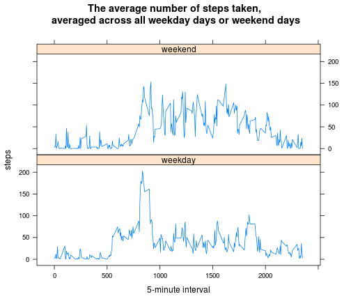

# Reproducible Research: Peer Assessment 1

## Introduction

It is now possible to collect a large amount of data about personal movement using activity monitoring devices such as a Fitbit, Nike Fuelband, or Jawbone Up. These type of devices are part of the "quantified self" movement - a group of enthusiasts who take measurements about themselves regularly to improve their health, to find patterns in their behavior, or because they are tech geeks. But these data remain under-utilized both because the raw data are hard to obtain and there is a lack of statistical methods and software for processing and interpreting the data.

This assignment makes use of data from a personal activity monitoring device. This device collects data at 5 minute intervals through out the day. The data consists of two months of data from an anonymous individual collected during the months of October and November, 2012 and include the number of steps taken in 5 minute intervals each day.

## Data

The data for this assignment can be downloaded from the course web site:

* Dataset: [Activity monitoring data](https://d396qusza40orc.cloudfront.net/repdata%2Fdata%2Factivity.zip) [52K]

The variables included in this dataset are:

* **steps**: Number of steps taking in a 5-minute interval (missing values are coded as NA)

* **date**: The date on which the measurement was taken in YYYY-MM-DD format

* **interval**: Identifier for the 5-minute interval in which measurement was taken

The dataset is stored in a comma-separated-value (CSV) file and there are a total of 17,568 observations in this dataset.

## Assignment

This assignment will be described in multiple parts. You will need to write a report that answers the questions detailed below. Ultimately, you will need to complete the entire assignment in a **single R markdown** document that can be processed by **knitr** and be transformed into an HTML file.

Throughout your report make sure you always include the code that you used to generate the output you present. When writing code chunks in the R markdown document, always use echo = TRUE so that someone else will be able to read the code. **This assignment will be evaluated via peer assessment so it is essential that your peer evaluators be able to review the code for your analysis.**

For the plotting aspects of this assignment, feel free to use any plotting system in R (i.e., base, lattice, ggplot2)

Fork/clone the [GitHub repository created for this assignment](http://github.com/rdpeng/RepData_PeerAssessment1). You will submit this assignment by pushing your completed files into your forked repository on GitHub. The assignment submission will consist of the URL to your GitHub repository and the SHA-1 commit ID for your repository state.

NOTE: The GitHub repository also contains the dataset for the assignment so you do not have to download the data separately.

### Set global options

```r
options(scipen = 999)  # disable scientific notation
```


### Loading and preprocessing the data

Load the data

```r
## create rawData directory and unzip rawdata
if (!file.exists("./rawData/activity.csv")) {
    unzip("./activity.zip", exdir = "./rawData")
}

## load activty.csv
activity <- read.csv("./rawData/activity.csv")
str(activity)
summary(activity)
```


Process/transform the data (if necessary) into a format suitable for analysis

```r
## create dataframe with missing values removed
activity.noNA <- na.omit(activity)  # drop NA values and save to new data.frame
rownames(activity.noNA) <- NULL  # remove row names
activity.noNA$date <- as.Date(activity.noNA$date)  # convert 'activity.noNA$date' to date object
```


### What is mean total number of steps taken per day?

For this part of the assignment, you can ignore the missing values in the dataset.

```r
str(activity.noNA)  # check structure and display new dimensions
```

```
## 'data.frame':	15264 obs. of  3 variables:
##  $ steps   : int  0 0 0 0 0 0 0 0 0 0 ...
##  $ date    : Date, format: "2012-10-02" "2012-10-02" ...
##  $ interval: int  0 5 10 15 20 25 30 35 40 45 ...
##  - attr(*, "na.action")=Class 'omit'  Named int [1:2304] 1 2 3 4 5 6 7 8 9 10 ...
##   .. ..- attr(*, "names")= chr [1:2304] "1" "2" "3" "4" ...
```

```r
summary(activity.noNA)  # check NA's removed
```

```
##      steps            date               interval   
##  Min.   :  0.0   Min.   :2012-10-02   Min.   :   0  
##  1st Qu.:  0.0   1st Qu.:2012-10-16   1st Qu.: 589  
##  Median :  0.0   Median :2012-10-29   Median :1178  
##  Mean   : 37.4   Mean   :2012-10-30   Mean   :1178  
##  3rd Qu.: 12.0   3rd Qu.:2012-11-16   3rd Qu.:1766  
##  Max.   :806.0   Max.   :2012-11-29   Max.   :2355
```


Make a histogram of the total number of steps taken each day

```r
hist(tapply(activity.noNA$steps, activity.noNA$date, sum), main = "Total number of steps taken each day", 
    xlab = "Total number of steps", ylab = "Frequency")
```

 


Calculate and report the **mean** and **median** total number of steps taken per day

```r
mean(tapply(activity.noNA$steps, activity.noNA$date, sum))  # reports the mean total number of steps taken per day
```

```
## [1] 10766
```

The mean total number of steps taken per day is 10766 


```r
median(tapply(activity.noNA$steps, activity.noNA$date, sum))  # reports the median total number of steps taken per day
```

```
## [1] 10765
```

The median total number of steps taken per day is 10765


### What is the average daily activity pattern?

Make a time series plot (i.e. type = "l") of the 5-minute interval (x-axis) and the average number of steps taken, averaged across all days (y-axis)


```r
# create summary dataframe using melt and cast from 'reshape2' package
library(reshape2)
activity.noNA.melt <- melt(activity.noNA, id = c("interval"), measure.vars = "steps")  # melt data
activity.noNA.cast <- dcast(activity.noNA.melt, interval ~ variable, mean)  # cast(data, formula, function) 
```


```r
# Create plot using base graphics plot function
with(activity.noNA.cast, plot(interval, steps, type = "l", main = "Average number of steps taken, averaged across all days", 
    xlab = "5-minute interval", ylab = "steps"), )
```

 


Which 5-minute interval, on average across all the days in the dataset, contains the maximum number of steps?

```r
which.max(activity.noNA.cast$steps)  # index of 5-minute interval containing the maximum number of steps
```

```
## [1] 104
```

```r
activity.noNA.cast$steps[104]  # check maximum number of steps looks ok by comparing with plot above
```

```
## [1] 206.2
```

```r
activity.noNA.cast$interval[104]  # report interval with maximum number of steps
```

```
## [1] 835
```

The 5-minute interval that contains the maximum number of steps is located at row number (index) 104 in the dataset and corresponds to 'interval' 835. This interval contains 206 steps on average across all the days in the dataset.

### Imputing missing values 

Note that there are a number of days/intervals where there are missing values (coded as NA). The presence of missing days may introduce bias into some calculations or summaries of the data.

Calculate and report the total number of missing values in the dataset (i.e. the total number of rows with NAs)

```r
nrow(activity) - nrow(na.omit(activity))  # report the number of rows with NAs
```

```
## [1] 2304
```


Devise a strategy for filling in all of the missing values in the dataset. The strategy does not need to be sophisticated. For example, you could use the mean/median for that day, or the mean for that 5-minute interval, etc.

```r
# strategy is to use the library MICE for multiple imputations this is
# probably the easiest way
```


Create a new dataset that is equal to the original dataset but with the missing data filled in.

```r
## NOTE: The imputation process takes at least 15 minutes on my computer I
## saved the output to imputed.csv so don't have to regnerate each time R
## script executes If raw data changes, uncomment imputation script and
## re-run script

## create procData directory and create imputed dataset
if (!file.exists("./procData/imputed.csv")) {
    dir.create("procData")
    # install.packages('mice') # you need to install this library
    library(mice)
    activity.imputed <- complete(mice(activity))
    write.csv(activity.imputed, file = "./procData/imputed.csv", row.names = FALSE)
}

## load cached imputed dataframe
activity.imputed <- read.csv("./procData/imputed.csv")  # here is a cached copy of the imputed data
summary(activity.imputed)
```


Make a histogram of the total number of steps taken each day 

```r
hist(tapply(activity.imputed$steps, activity.imputed$date, sum), main = "Total number of steps taken each day", 
    xlab = "Total number of steps", ylab = "Frequency")
```

 


Calculate and report the **mean** and **median** total number of steps taken per day. 


```r
mean(tapply(activity.imputed$steps, activity.imputed$date, sum))  # mean total number of steps taken per day
```

```
## [1] 11133
```

```r
median(tapply(activity.imputed$steps, activity.imputed$date, sum))  # median total number of steps taken per day
```

```
## [1] 11458
```


Do these values differ from the estimates from the first part of the assignment? What is the impact of imputing missing data on the estimates of the total daily number of steps?


```r
diffLogical <- mean(tapply(activity.noNA$steps, activity.noNA$date, sum)) == 
    mean(tapply(activity.imputed$steps, activity.imputed$date, sum))
diffPrint <- if (diffLogical == TRUE) {
    print("Do these values differ? No")
} else {
    print("Do these values differ? Yes")
    print(paste("The mean has changed from ", round(mean(tapply(activity.noNA$steps, 
        activity.noNA$date, sum)), 0), " to ", round(mean(tapply(activity.imputed$steps, 
        activity.imputed$date, sum)), 0), " after the data was imputed", sep = ""))
    print(paste("The median has changed from ", round(median(tapply(activity.noNA$steps, 
        activity.noNA$date, sum)), 0), " to ", round(median(tapply(activity.imputed$steps, 
        activity.imputed$date, sum)), 0), " after the data was imputed", sep = ""))
}
```

```
## [1] "Do these values differ? Yes"
## [1] "The mean has changed from 10766 to 11133 after the data was imputed"
## [1] "The median has changed from 10765 to 11458 after the data was imputed"
```


The histogram of the imputed data shows the distribution is more symmetrical compared to the histogram generated by the the data set with the NA's removed 


### Are there differences in activity patterns between weekdays and weekends?

For this part the weekdays() function may be of some help here. Use the dataset with the filled-in missing values for this part.

Create a new factor variable in the dataset with two levels - "weekday" and "weekend" indicating whether a given date is a weekday or weekend day.

```r
## create a new factor activity.imputed$weekday
activity.imputed$weekday <- NULL
# define days which are weekdays
weekday <- c("Monday", "Tuesday", "Wednesday", "Thursday", "Friday")
# define days which are weekend days
weekend <- c("Sunday", "Saturday")
# transform date variable from factor to Date object
activity.imputed$weekday <- weekdays(as.Date(activity.imputed$date))
# replace weekdays with 'weekday'
activity.imputed$weekday[activity.imputed$weekday %in% weekday] <- "weekday"
# replace weekends with 'weekend'
activity.imputed$weekday[activity.imputed$weekday %in% weekend] <- "weekend"
# transform weekday variable to a factor
activity.imputed$weekday <- as.factor(activity.imputed$weekday)
# check structure
str(activity.imputed)
```


Make a panel plot containing a time series plot (i.e. type = "l") of the 5-minute interval (x-axis) and the average number of steps taken, averaged across all weekday days or weekend days (y-axis).

```r
# create summary dataframe using melt and cast from 'reshape2' package
library(reshape2)
activity.imputed.melt <- melt(activity.imputed, id = c("interval", "weekday"), 
    measure.vars = c("steps"))  # melt data
activity.imputed.cast <- dcast(activity.imputed.melt, interval + weekday ~ variable, 
    mean)  # cast(data, formula, function) 
```


```r
# Create plot using lattice graphics
library(lattice)
xyplot(steps ~ as.numeric(interval) | weekday, data = activity.imputed.cast, 
    type = "l", layout = c(1, 2), main = "The average number of steps taken, \naveraged across all weekday days or weekend days", 
    ylab = "steps", xlab = "5-minute interval")
```

 

